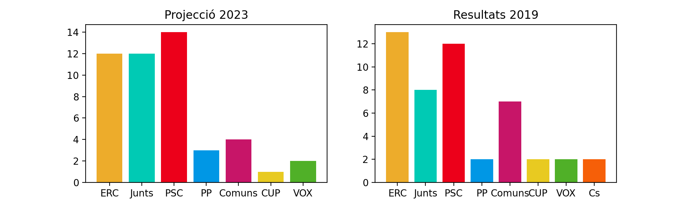
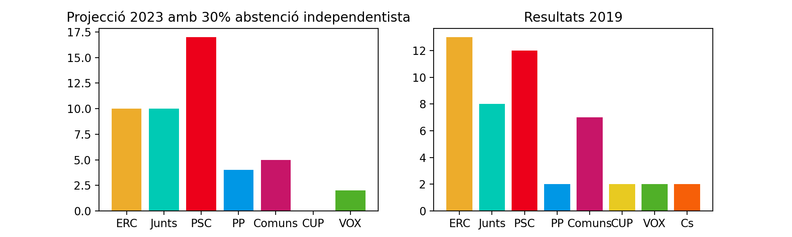
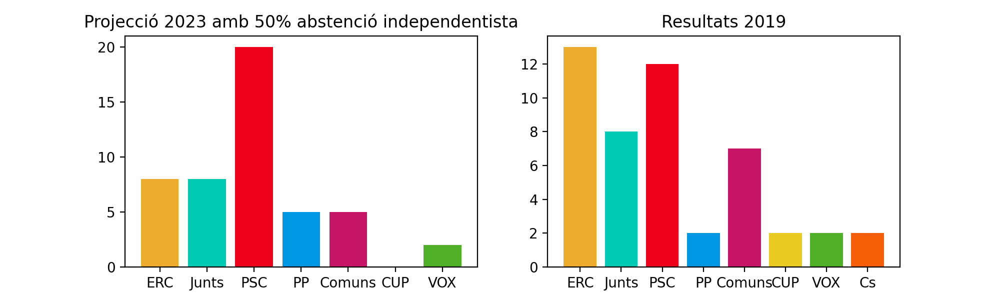
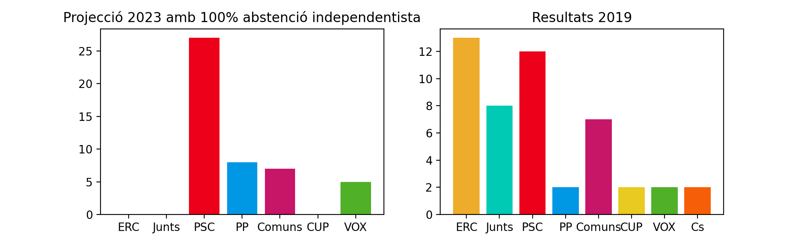

# Projecció Eleccions

## Index de continguts
1. [Antecedents](#Antecedents)
2. [Metodologia](#Metodologia)
3. [DISCLAIMER](#Disclaimer)
4. [TO-DO](#TO-DO)
5. [English](#English)

Aquest projecte sorgeix amb la idea d'analitzar possibles resultats electorals a Catalanunya de les eleccions generals de Juliol de 2023.

## Antecedents
La inoperància dels partits independentistes ha decebut les bases del moviment independentista. Per aquest motiu han sorgit molts moviments cridant a l'abstenció, el vot nul o el vot en blanc indefinit fins que els partits independentistes rectifiquin.

Com a contrapartida, els partits independentistes han fet campanya dient que si no els votes, dones pas a que la dreta governi. 

Aquí uns quants exemples de tuits que utilitzen la por a la dreta per a animar la gent a anar a votar:

<blockquote class="twitter-tweet">
I ara que surtin suposats independentistes amb abstencions, vots nuls, blancs i demés formes de regalar escons als ultres i als del règim del 78. <a href="https://t.co/XXulzYf1Hc">https://t.co/XXulzYf1Hc</a>
&mdash; Marc Colomer (@MarcColomer) <a href="https://twitter.com/MarcColomer/status/1675866645753896961?ref_src=twsrc%5Etfw">July 3, 2023</a></blockquote> 

<blockquote class="twitter-tweet">
El <a href="https://twitter.com/hashtag/23J?src=hash&amp;ref_src=twsrc%5Etfw">#23J</a> no et quedis a casa. Protegim Catalunya de l’extrema dreta <a href="https://twitter.com/hashtag/ProtegimGirona?src=hash&amp;ref_src=twsrc%5Etfw">#ProtegimGirona</a> <a href="https://twitter.com/hashtag/ProtegimCatalunya?src=hash&amp;ref_src=twsrc%5Etfw">#ProtegimCatalunya</a> <a href="https://t.co/hgHKEdQ7KN">https://t.co/hgHKEdQ7KN</a>
&mdash; Joan Margall Sastre (@joanmargall) <a href="https://twitter.com/joanmargall/status/1674680693572481026?ref_src=twsrc%5Etfw">June 30, 2023</a></blockquote> 

És cert que si els votants independentistes s'abstenen vindrà la dreta? Quins son els partits que surten beneficiats si els votants independentistes s'abstenen?

## Metodologia

Utilitzo com a base els resultats de les recents eleccions municipals de Maig de 2023. Amb aquests resultats puc fer una predicció de resultats a les generals de Juliol.

Amb aquesta base és possible calcular quins resultats serien d'esperar si hi hagués diferents graus d'abstenció indepentista. 
<ul>
    <li> Amb un 30% d'abstenció independentista respecte dels resultats de les municipals, els escons estarien repartits de la següent manera:
        
    La CUP ja no entraria perquè no passaria el tall del 3%.
    </li>
        <li> Amb un 50% d'abstenció independentista:
        </li>
        <li> Finalment, amb un 100% d'abstenció independentista:
        </li>
</ul>
Es pot veure clarament que el clar beneficiat de l'abstenció independentista és el PSOE.

## DISCLAIMER

Aquests càlculs pretenen ser un exercici de quin podia ser un possible efecte d'abstenció del sector independentista, no és una predicció de resultats electorals. Dóna una idea a l'engròs.

## TO-DO:

<ul>
<li> Treure l'efecte Trias que beneficia Junts en la projecció a les generals</li>
<li> Afegir abstenció diferencial, és a dir, preveure diferents graus d'abstenció a cada un dels diferents partits independentistes</li>
<li> Automatitzar les gràfiques per a seleccionar mitjançant botó, quina abstenció es vol seleccionar.</li>

    
</ul>

__
## English

## Background

Project to analyse possible electoral outcomes of the Spanish General Elections from July 2023 in Catalonia.

I have projected the results obtained by the catalan parties on the recent municipal polls to the general elections, taking into account several possible escenarios:
<ul>
    <li> Project the plain results obtained on the municipal elections from May 28 to see how would the seats projection look like on each of the Catalana provinces (Barcelona, Girona, Lleida and Tarragona) 
    </li>
    <li> Project the results obtained on the municipal elections taking into account a possible diferential abstention from the independentist parties (ERC, Junts and CUP)
    </li>
</ul>

On both cases, I compare the projected results with the results obtained in Catalonia on the last General Elections from Nov 2019. 

